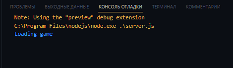
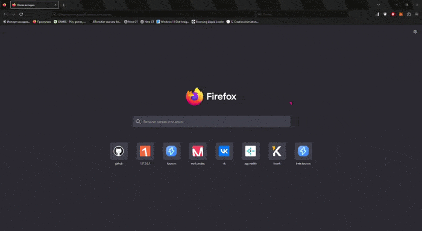
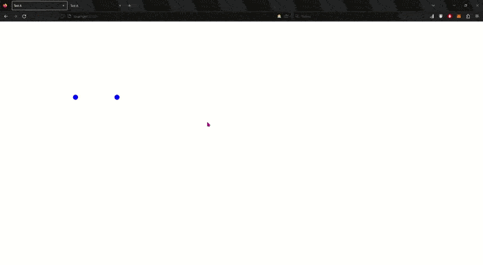

# Test-A


## Installation

<p>First we need to install <a href="https://nodejs.org/en/download">Node.js</a>
In my case, this is Node.js for 64-bit Windows (Windows Installer (.msi))</p>

```npm init```

```npm install --save express socket.io```

<p>To quickly configure the server, it is advisable to use the Express framework, and to process web sockets on the server, a package socket.io .</p>

<p style="text-align: center"></p>


##### <p style="text-align: center">For personal convenience, instead of the usual CMD console, I use extensions for Visual Studio Code, which greatly simplifies and speeds up the work</p>


<p>We see that our server has started successfully!</p>

## Launch and health check

Since the port is specified in the settings of our server **5000** , we go to this url:

``` http://localhost:5000/ ```

<p style="text-align: center"></p>

As you can see, the server has successfully connected us to the game and we can move around in virtual space.

Next, we need to make sure that other players are also able to connect. 
Let's open the second tab to create an impromptu entry of the second player on our playing field.

<p style="text-align: center"></p>


<p style="text-align: center">Alas, due to some problems with my screen capture application, I can't show the work in the broadcast</p>

